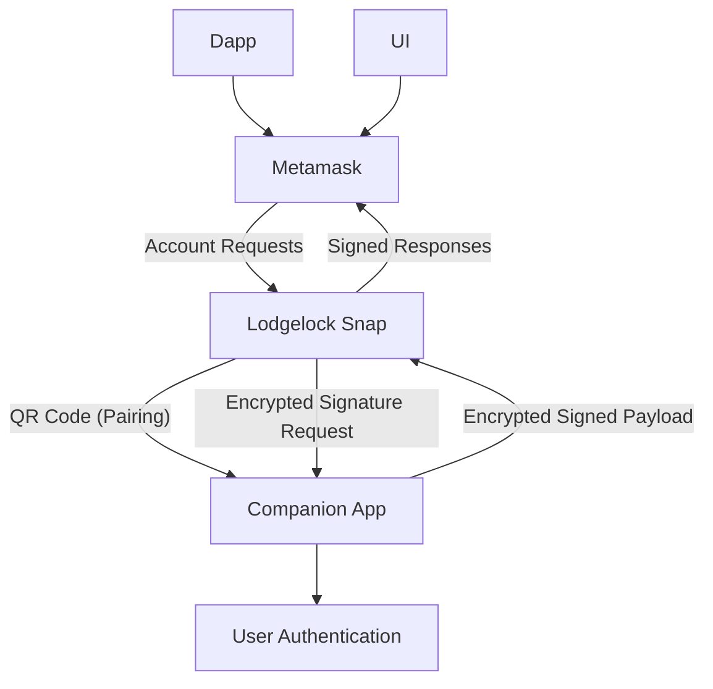

# Lodgelock

⚠️ Lodgelock is in active development and not yet suitable for holding significant funds.

Lodgelock is a keystore companion app for MetaMask that keeps private keys off your desktop, improving security while retaining convenience. It's designed to provide a similar convenience to using a browser-based wallet, while being more resiliant to common private-key-theft attack vectors.  It **isn't designed to replace hardware wallets**, but rather to provide a more ergonomic starting point for people wishing to increase their security.

## Features

- Mobile-based private key storage
- Biometric approval required for all signing requests
- Integration with MetaMask Snap
- Cloud signaling via Firebase (or Firebase-like APIs) for communication between Snap and mobile
- Seamlessly works with multiple wallet sessions.

### Comparison

I've tested several existing MPC/account-management snaps. Each has strengths, but with Lodgelock I tried to emphasize portability, consistent per-sign authentication, and a clearer UX.

| Wallet Type            | Time to Sign | Resistance to Key Theft                 | Backup & Recovery            | Dependency on External Services | Cost / Accessibility           |
| ---------------------- | ------------ | --------------------------------------- | ---------------------------- | ------------------------------- | ------------------------------ | 
| **Lodgelock**          | \~1 min      | High (keys stay on mobile)              | Seed phrase backup in app    | Firebase / custom servers       | Free (smartphone only)         | 
| **Browser Extensions** | \~30 seconds | Low (keys hot in browser memory)        | Seed phrase backup           | None                            | Free                           | 
| **WalletConnect**      | 1-2 min      | High (keys stay on mobile)              | Seed phrase backup in app    | WalletConnect relay servers     | Free                           | 
| **MPC Wallets**        | \~1 min      | Medium–High (depends on implementation) | Proprietary recovery schemes | Typically 3rd-party infra       | Free / enterprise SaaS         |
| **Hardware Wallets**   | 2–5 min      | Very High (keys in secure element)      | Seed phrase backup           | None                            | Hardware device (\~\$70–\$200) |

| Snap             | Backup & Recovery                                 | Auth for Signing                              | Dependencies                       |
| ---------------- | ------------------------------------------------- | --------------------------------------------- | ---------------------------------- |
| **Lodgelock**    | Standard seed phrase (portable)                   | Biometric required each sign                  | Firebase (or Firebase-like APIs)   |
| **Para**         | Proprietary backup kit (PDF, non-portable)        | Session-based (no per-sign check)             | Central infra                      |
| **Silent Shard** | Proprietary recovery (Google account integration) | Optional biometric (on load only)             | Central infra                      |
| **Safeheron**    | 2-of-3 MPC with shard recovery option             | Two devices required per sign (browser + app) | LAN connection (no central server) |

## Architecture Overview

1. Lodgelock is split into two main components:
    - MetaMask Snap
    - Runs in the browser
    - Acts as a request proxy for account creation & transaction signing
2. Mobile Companion App
    - Expo app
    - Stores private keys behind biometric authentication
    - Recieves proxied requests & handles them locally, returning signed payloads
    - Handles device pairing via QR code with shared secret to avoid man-in-the-middle

## Security

Lodgelock is still in development, so there may be bugs or other undesired behavior. Avoid storing large amount of money in Lodgelock accounts, and always make sure to backup your seed phrase.

Lodgelock is designed to:

- Ensures private keys never leave the mobile device (aside from manual seed phrase backups).
- Requires biometric approval for any operation that interacts with the seed phrase or private keys.
- Uses a shared secret between the snap and companion app to facilitate encrypted communications, avoiding man-in-the-middle attacks and snooping.

### Portability

Lodgelock is designed to work with multiple accounts and wallet sessions. The companion app can pair with multiple clients (multiple instances of metamask across different computers, different kinds of clients, etc) and seperately sets up shared secrets & encrypted tunnels with each.  This way, the same wallet can be used across many devices without increasing the attack surface.

### Account Backup & Recovery

Lodgelock generates and stores a standard 12-word seed phrase on the mobile device on setup. It can be backed up when first created, or anytime afterwards from the settings page. If you decide to switch to a different wallet after using lodgelock, you can [import your seed phrase](https://support.metamask.io/start/use-an-existing-wallet/#import-using-a-secret-recovery-phrase) into this new wallet to transfer over all accounts.

## Architecture Overview



## Development

### Requirements

- Node v20
- Yarn
- Expo Go for mobile testing

### Running

```bash
yarn dev:snap
yarn dev:mobile
```

### Test Application

Use the localhost site to install the snap & test signatures.

### License

GPL-3.0

- Note: Originally forked from the MetaMask Snap Template.
